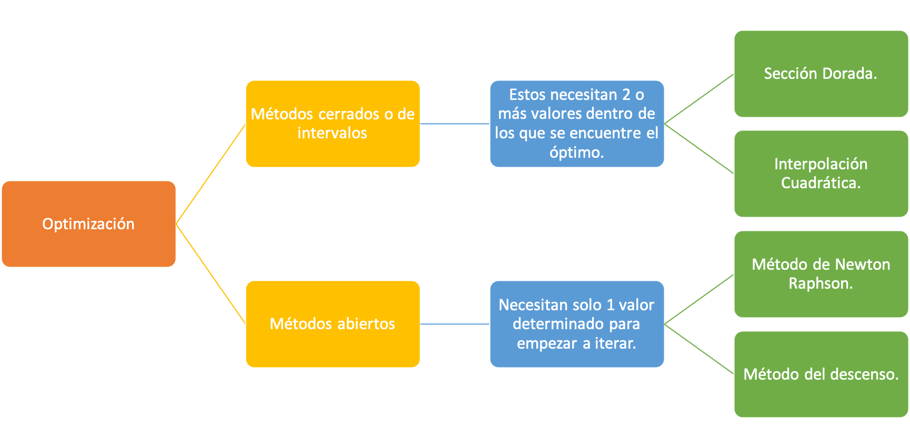

# Unidad 6: Optimización Irrestricta

## Contenido de la unidad

## Optimización unidiemensional no restringida.

El objetivo es encontrar el máximo o el mínimo de una función de una variable sin restricciones, es decir, no lineal.

---

